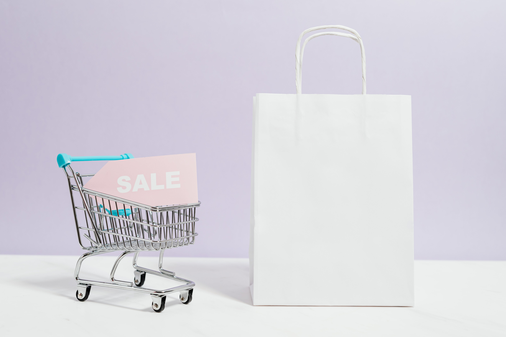
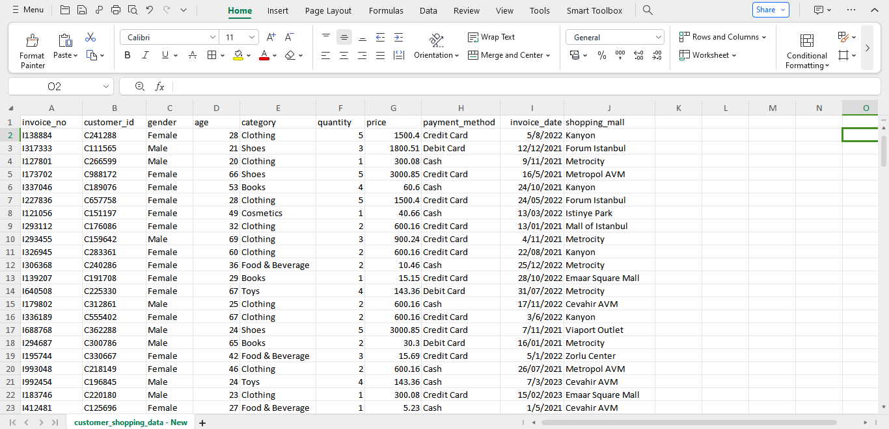
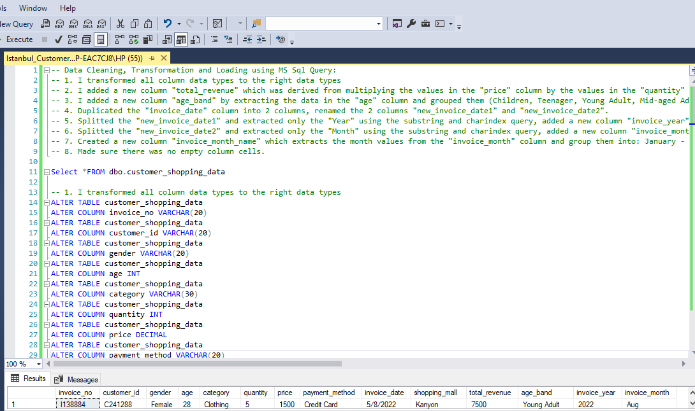
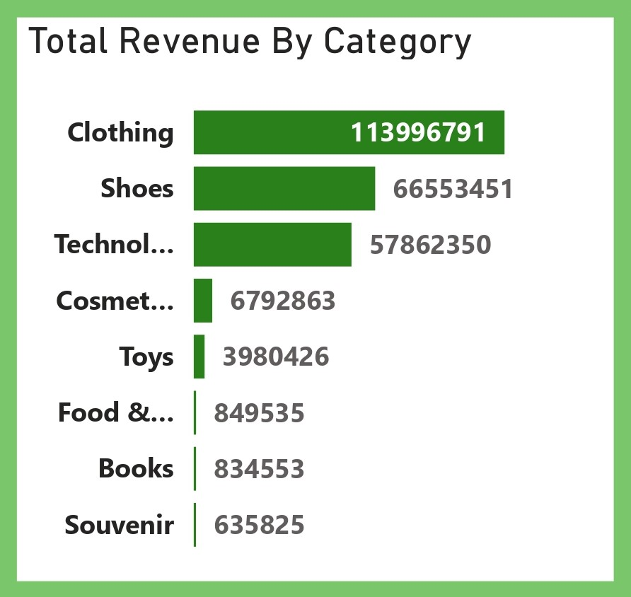
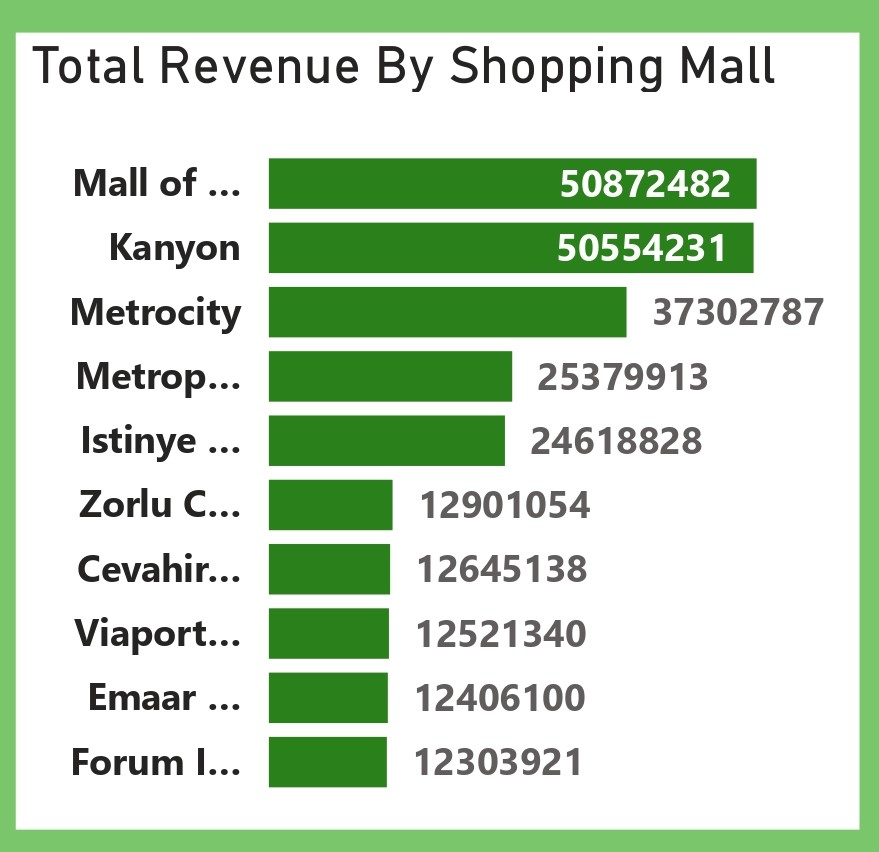
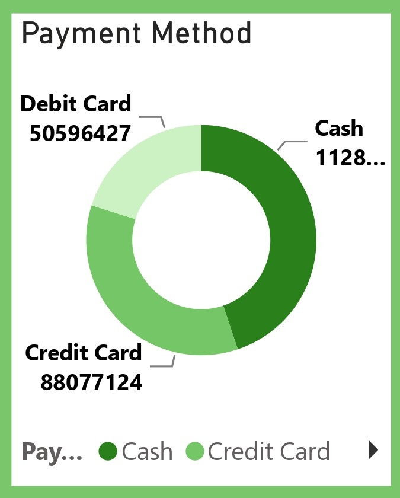
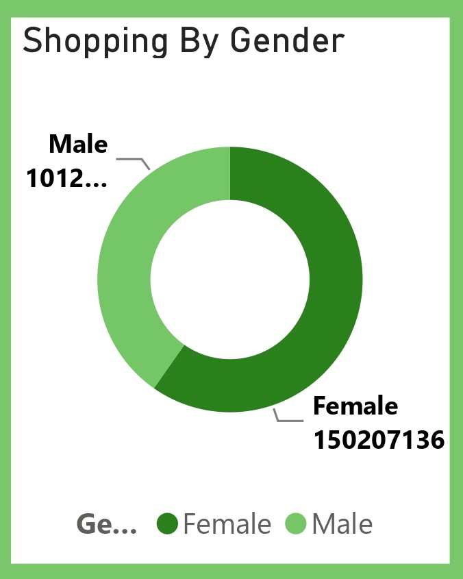
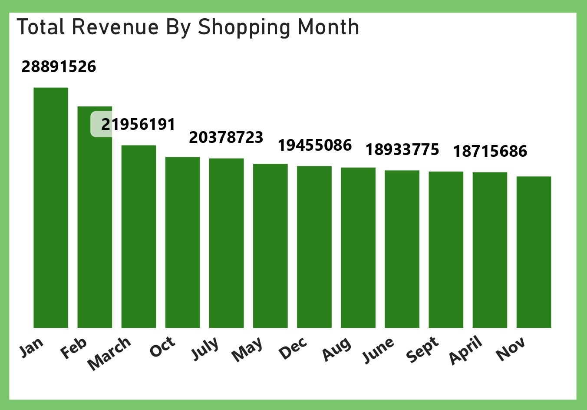

# Istanbul Customer Shopping (2021-2023) Analysis

 

## Table of Contents
- [Project Overview](#project-overview)
- [Objectives](#objectives)
- [Tools Used](#tools-used)
- [Visualization in Power BI](#visualization-in-power-bi)
- [Project Analysis](#project-analysis)
- [Visuals in Power BI Report](#visuals-in-power-bi-report)
- [Recommendations On Improving Customer Shopping Experience in Istanbul To Attract More Local and international Patronage](#recommendations-on-improving-customer-shopping-experience-in-istanbul-to-attract-more-local-and-international-patronage)
 

## Project Overview
### Introduction:
Step into the shopping environment of Istanbul! This study explores the shopping culture of Istanbul examining data gathered from 10 shopping centers between 2021 and 2023. Our extensive dataset covers a range of shoppers gathering information, from age groups and genders to offer a complete picture of shopping behaviors in this lively city.
 
 

### Dataset Overview:
- Information in this dataset is of essence towards an understanding of the dynamics of shopping in Istanbul. In greater detail, it includes invoice number, customer ID, age and sex, type of payment means, category of products, quantity, price, dates of orders, and locations where shopping malls are located.
- Such a rich dataset will be subjected to detailed analysis so that hidden patterns, trends, and correlations can be unearthed, yielding valuable insights into consumer behavior and diversion shopping preferences across demographics.

- This dataset is a .csv file made up of a single table named customer_shopping_data.csv and was provided by [Quantum Analytics](https://www.quantumanalyticsco.org/). You can click on this [link](customer_shopping_data.csv) to access the raw data file. This dataset table is made up of 10 columns and 99,547 rows of data.  

Here's a data dictionary of the dataset explaining the table fields in details:
| Table                              | Field                    | Description                            |            
|:-----------------------------------|:------------------------ |:-------------------------------------- |
|Customer_shopping_data.csv          | invoice_no               | This column contains the unique identifier assigned to each customer. It allows for the tracking and analysis of shopping behavior and preferences of individual customers across multiple transactions.    |
|                                    | gender                   | This column indicates the gender of the customer involved in the transaction. It provides insights into the demographic composition of shoppers and allows for gender-based analysis of shopping habits and preferences.     |
|                                    | age                      | This column represents the age of the customer involved in the transaction. It enables age-based segmentation and analysis of shopping behavior, allowing for insights into how different age groups interact with products and brands.         |
|                                    | category                 | This column specifies the category or type of product purchased in the transaction. It categorizes products into distinct groups based on their characteristics or functions, facilitating analysis of sales trends and preferences across different product categories.         |
|                                    | quantity                 | This column indicates the quantity of the product purchased in the transaction. It represents the number of units or items bought by the customer, providing insights into purchasing patterns and consumption habits.        |
|                                    | price                    | This column denotes the price of the product per unit or item. It represents the cost of the product purchased by the customer, allowing for analysis of transaction values, pricing strategies, and revenue generation.         |
|                                    | payment_method           | This column specifies the method of payment used for the transaction. It includes different payment options such as cash, credit card, debit card, mobile payment, etc., providing insights into payment preferences and transactional behaviors.       |
|                                    | invoice_date             | This column indicates the date and time when the transaction took place. It records the timestamp of each purchase, enabling analysis of sales trends over time, seasonality, and temporal patterns in shopping behavior.        |
|                                    | shopping_mall            | This column identifies the shopping mall or retail location where the transaction occurred. It allows for analysis of shopping preferences and behaviors across different mall locations, as well as assessment of the performance of individual malls in terms of foot traffic and sales.         |
 

## Objectives:
- Understand the leverage effect of total revenue by product categories.
- Analyze changes in shopping behavior depending on locations across different shopping malls.
- Understand how many customers there are for all shopping malls combined.
- Analyze changes in shopping behavior depending on different methods of payment.
- Analyze changes in shopping behavior depending on shopping by gender.
- Understand the relationships between demographic factors like age band, gender, and product category on total revenue.
- Understand trends and patterns in buying across age groups, genders, and the total amount spent.
- Evaluate the in-store behavior differences by the total amount spent by shopping month.

## Expected Outcomes:
The projects goal is to offer an understanding of how shopping trends, in Istanbul're evolving using the dataset. These insights will help in making choices that improve the shopping experience for customers drive business expansion and enhance inventory management efficiency. This data will be valuable to stakeholders such, as retailers, marketers and city planners.

 
 

### Skills Utilized
1. Data Cleaning
2. Data Visualiziation
3. Descriptive Analytics
4. Critical Thinking and Problem Solving
5. Communication and Reporting
 

### Tools Used
1. MS Sql Server
    - Was used to:
        1. Clean,
        2. Transform the datasets for this analysis.
           
2. Power BI (Was used to create reports and dashboard for this analysis)
    - The following Power BI Features were incorporated:
        1. DAX
        2. Quick Measures
        3. Filters
        4. Tooltips
 

### Data Cleaning, Transformation and Loading using MS Sql Server:
1. Made sure that all the data types of the tables in the dataset are of the right data type.
2. I added a new column __"total_revenue"__ which was derived from multiplying the data in the __"price"__ column by the data in the __"quantity"__ column.
3. I added a new column __"age_band"__ by extracting the data in the __"age"__ column and grouped them (Children, Teenager, Young Adult, Mid-aged Adult, and Old Adult) using the _"Update"_ and _"Set query"_.
4. Duplicated the __"invoice_date"__ column into 2 columns, renamed the 2 columns to __"new_invoice_date1"__ and __"new_invoice_date2"__.
5. Splitted the __"new_invoice_date1"__ and extracted only the __"Year"__, added a new column __"invoice_year"__ with an int data type and extracted the __"new_invoice_data1"__ column data into it, then dropped the __"new_invoice_data1"__ column from the table.
6. Splitted the __"new_invoice_date2"__ and extracted only the __"Month"__, added a new column __"invoice_month"__ with an int data type and extracted the __"new_invoice_data2"__ column data into it, dropped the __"new_invoice_data2"__ column from the table.
7. Created a new column __"invoice_month_name"__ which extracts the month values from the __"invoice_month"__ column and group them into: _January - December_, dropped the __"invoice_month"__ column, renamed the __"invoice_month_name"__ column to __"invoice_month"__.

 

**Raw Data Screenshot**
- Below is a screenshot of a part of the raw data in .csv file format. You can preview the dataset [here](customer_shopping_data.csv).

Raw Data Screenshot                                                               |                       
:---------------------------------------------------------------------------------:|

 

**Final MS Sql Server query screenshot**
- Below is a screenshot of a part of the cleaned data in MS Sql. 

Sql Query Screenshot                                                               |                       
:---------------------------------------------------------------------------------:|

You can preview the MS Sql Server query file [here](Istanbul_Customer_Shopping_Project.sql)
 
 

## Data Modelling
No data modelling was required since we had just one table for this analysis.
 
 

## Visualization in Power BI:
#### Report Image
_Analysis_Dashboard.jpg)
 
 

### Project Analysis:
From the analysis, i made the Key Performance findings below:
- The Total Revenue from all the Shopping Malls is __₺251,505,794M__.
- The Number of Shopping Malls for this analysis is __10__.
- The Number of Product Categories is __8__.
- Total Number of Customers is __99,457__.
- Number of Male Customers is __39.975__.
- Number of Female Customers is __59,482__.
- The Average Revenue By Customer is __₺2,529__.
- The Average Age of Customers is __43__.
 
 

- 

- **The Total Revenue By Product Category:**
- In this analysis, The provided total revenue by product category indicates a clear hierarchy in terms of revenue generation within the shopping dataset. Here's a breakdown of the top revenue-generating categories:
- __Clothing Tops: $113,996,791__
  - Clothing tops emerge as the top revenue-generating category, signifying a strong demand for Turkish fashionable attire among consumers within Turkey and international customers. In 
    Turkish shopping culture, clothing holds significant importance, reflecting personal style and cultural norms.
    preferences, and social influences.
- __Shoes: $66,553,451__
  - Shoes represent another lucrative category, Turkey is known for durable and classy footwears, suggesting that local and international consumers prioritize footwear as an essential 
    aspect of their wardrobe. Turkish shopping culture often emphasizes the importance of footwear in completing an outfit, whether for everyday wear or special occasions. 
- __Technology: $57,862,550__
  - The technology category encompasses a wide range of electronic devices and gadgets, indicating a growing interest in digital products among consumers locally and internationally. In 
    Turkish shopping culture, there is a noticeable trend towards embracing technology for both practical and recreational purposes.
- __Cosmetics: $6,792,863__
  - Cosmetics cater to personal grooming and self-care needs, reflecting a desire among consumers to enhance their appearance and well-being. Turkish shopping culture places value on 
    personal grooming and maintaining a polished appearance, contributing to the demand for Turkish cosmetics products locally and internationally. 
- __Toys: $3,980,426__
  - Toys appeal to both children and adults, serving as sources of entertainment, creativity, and nostalgia. In Turkish shopping culture, family-oriented values and celebrations play a 
    significant role, driving demand for toys for children and gifts for special occasions. 
- __Food & Beverage: $849,535__
  - Food and beverage products fulfill essential needs for nourishment and enjoyment, reflecting consumer preferences for culinary experiences and dietary choices. Turkish shopping 
    culture encompasses rich culinary traditions and a love for food, influencing the demand for diverse food and beverage products. 
- __Books: $834,553__
  - Books cater to intellectual pursuits, education, and leisure reading, reflecting a desire among consumers for knowledge and entertainment. In Turkish shopping culture, there is a 
    longstanding tradition of literary appreciation and intellectual discourse, driving demand for books across various genres and subjects. 
- __Souvenir: $635,825__
  - Souvenirs serve as tangible mementos of travel experiences and cultural heritage, appealing to tourists and locals alike. In Turkish shopping culture, there is a thriving tourism 
    industry and a rich historical heritage, contributing to the demand for unique souvenirs that capture the essence of Turkish culture. 
 
 

- 

- **The Total Revenue By Shopping Mall Location:**
- This, in my estimates, will give a category-by-category price breakdown at the shopping mall level, providing relevant information on consumer spending and behavior for these various retail destinations within the Istanbul region. Every shopping mall represents an individual shopping environment, each catering to diverse demographics and tastes of the local population.
- __Mall of Istanbul: ₺50,872,482__
_Mall of Istanbul comes out to be the highest revenue outputting mall in this case, portraying high popularity for consumers in a first position for a shopping destination in Istanbul due probably to its vast retail mix or prime location or strong campaigns.
- __Kanyon: ₺50,554,231__
- Kanyon outpaces the Mall of Istanbul in this ranking, underlining its strong appeal and competitive position in the retail landscape of Istanbul. With its well-known innovative architecture and upscale shopping experience, Kanyon caters more to an affluent group of shoppers in pursuit of luxury brands and upscale amenities.
- __Metrocity: ₺37,302,787__
This places Metrocity third in terms of total revenue, pointing further to the fact that it is one of the most visited shopping malls in Istanbul. Within the lively business district of Levent, Metrocity combines retail, dining, and entertainment activities for a large population of working professionals, residential homes, and tourists.
- __Metropol AVM TL: 25,379,913__
Metropol AVM has a stronger market position as it offers a convenient location and retail mix that attracts shoppers. Since it is a neighborhood shopping center, Metropol AVM serves more as a community center, catering to the needs of local people and providing them with convenience in shopping.
- __Istinye Park: ₺24,618,828__
- Istinye Park: One of the most prominent retail properties with a classy atmosphere, hosting fashion houses of luxury brands, and various leisure services offered therein. Located in another highly desirable neighborhood, Istinye Park caters to an affluent shopper who desires high-end fashion, gourmet dining, and culture.
- __Zorlu Centre: ₺12,901,054__
This center occupies a niche market position, appealing to more discerning shoppers through its mix of luxury brands, designer boutiques, and modern entertainment. Being a lifestyle destination, Zorlu Centre draws fashionable consumer and trendsetters who seek the unique experiences it has to offer.
- __Cevahir AVM: ₺12,645,138__
- Cevahir AVM rounds out the top five, demonstrating consistency in being both among the largest and most frequented of Istanbul's shopping malls. Well-known for its well-rounded combination of retail, entertainment, and family-friendly amenities, Cevahir AVM services a large demographic core of families with children, tourists, and shoppers on more limited budgets.
 
 

- 

- **Total Revenue By Payment Methods & an Analysis of Variations in Istanbul Shopping Behavior Based on Payment Methods:**
- Information regarding the breakup of total revenue by means of payment is very considerate. It shows the major trends in consumers' payment preferences and behavior in Istanbul. A deep understanding of all these variations could only help retailers and businesses better accommodate these different means of payment into daily life and enhance the overall shopping experience for consumers.
- __Cash Payment: ₺112,832,243 (44.86%)__
Cash is the most used method of payment, which straightaway hints that a great number of consumers in Istanbul prefer doing business using real currency. This disposition toward cash payments could be impelled by several factors:
    - __Cultural factor:__ Cash payments give way to traditional Turkish customs and cultural norms, where use of physical currency often seeks preference in transactions.
    - __Privacy and Anonymity__: Cash transactions provide customers, particularly those seeking steady privacy in their financial transactions, a level of anonymity.
    - __Financial Control:__ Some other consumers may like to pay through cash to exercise control over their spending so they will not incur any debt since transactions are limited only to available funds.
- __Credit Card: ₺88,077,124 35.02%__
Next to cash, credit card transactions come second in general revenue, reflecting the popularity and absolute need for electronic methods of payment in Istanbul's consumer behavior. The preference for credit cards can be conditioned by the following:
    – __Convenience__: Credit cards are an easy means of making payments for goods and services, with consumers not having to carry money on their persons.
    - __Rewards and Benefits:__ Many credit cards come with rewards, cashback, or loyalty points; therefore, consumers are inclined to use credit cards for their purchases in order to derive these benefits.
    - __Financial Flexibility:__ Credit cards allow consumers flexibility in terms of paying for purchases over time through an installment plan or a revolving credit line, thereby making them the better planners of their money.
- __Debit Card: ₺50,596,427 (20.12%)__
• Another large share of total revenue comes from debit card transactions, thereby evincing that debit cards issued by banks are tremendously popular with consumers in Istanbul for making payments in this city. This preference towards debit card payments could be driven by the following factors:
    – __Direct Access to Funds:__ Debit cards give everyday customers direct access to funds from their bank accounts, thus providing an easy and efficient way of making payments.
    - __Security and Fraud Protection:__ Debit cards involve secure PIN authentication and fraud monitoring that would encourage customers to make any purchases with a great deal of confidence.
    - __Budget Management:__ With debit cards, consumers' expenditure will be confined to the money available in their accounts, hence fostering prudent spending behavior without the risk of falling into debt.
 
 

- 

- **Total Revenue By Gender Shopping & an Analysis of Variations in Istanbul Shopping Behavior Based on Gender:**
- In my analysis, is the distribution of total revenue based on how much is contributed by the different genders, thus giving insights into the shopping behavior and preferences of consumers in Istanbul: 
- __Females: ₺150,207,136 (59.72%)__
  - The major contributors in this instance, females, clearly indicate the great purchasing power and influence that females have in the retail landscape of Istanbul. The reasons that can justify their great influence can be attributed to:
    - __Fashion and Beauty Preferences:__ Women possess an aspiration towards fashion, beauty, and personal care leading to higher sales in such categories.
    _ __Lifestyle and Household Purchases:__ Besides, the female consumer might also be the lead in purchasing household items, groceries, and other family-oriented products, reflecting their caregiving role and decision-making in household spending.
    - __Shopping Activity and Frequency:__ Shopping is more engaging for females than males. Therefore, these are the prime customers for your retail business, where you play with promotional offers, loyalty schemes, and targeted marketing campaign strategies to woo them.

- __Shopping by Males: ₺150,596,427 (40.28%)__
  – Males reflect a high percentage of total sales, though below the females by a small extent, hence an important consumer segment in the Istanbul Market. Shopping Patterns for Male's Candidates may be influenced by:
    - __Technology and Electronics:__ Men are real gadget lovers, electronic enthusiasts, and game lovers as well. Usually, this results in remarkable sales in the category. Retailers can always capture the hearts of male consumers by making a good range of technical products and accessories available all the time.
    - __Sports and Leisure:__ Men consumers may show dominance in buying sports equipment, outdoor, and leisure use gear. This would reflect their interest in physical fitness and recreation.
    - __Shopping Preferences and Convenience:__ Men may have different shopping appetites as compared to women, believing in the doctrine of simplicity, worth, and convenience in businesses.
 
 

- 

- **Total Revenue By Age Band and Product Category:**
- The analysis thus allows one to disaggregate total revenues by age band and product category, thus capturing the diverse shopping habits and tastes of many demographics that make up the sprawling metropolis of Istanbul. It is then possible to gain insight into consumer trends by looking at the various correlation channels between demographic factors—age-band, gender, and product category on total revenues, and understand how best to adapt marketing strategies accordingly.
- __Young Adults:__ Young adults form a large proportion of contribution to total revenue, particularly across categories such as clothing, shoes, and technology. Typically aged 20 to 39 years, this demographic group makes up one key segment with tastes and spending powers that vary greatly. From the part of young adults, trendsetting fashion and gadgets in tech and lifestyle products will call the shots on sales performance in the respective categories.
- __Middle-aged Adults:__ Middle-aged adults are the runners-up in generating the most money, and they have similar preferences: clothes, shoes, and technology products. Indeed, this age segment comprises a more stable and wealthy stratum with established purchasing habits. Quality, comfort, and practicality will, therefore, be highly regarded by middle-aged adults in the choice of goods to buy, hence regularly earning sales in apparel and footwear.
- __Old Adults:__ This segment normally includes 60-plus-year-old people who generate cash in most categories but at a comparatively lower spending level than the young adult demographics. It can be perceived that old adults are more conservative in their shopping behaviors and tendencies. Comfort, durability, and value for money are the premier factors in their purchasing behavior, which translates to stable sales in categories like clothing and shoes.
- __Teenagers:__ Adolescents are a smaller but equally important percentage of total sales. These age groups are most keenly interested in purchasing clothes, shoes, and technology. This demographic generally includes people from ages 13 through 19 years, which is a young and trend-oriented consumer crowd with money to spend via allowances or part-time jobs. Therefore, teens will be interested in fashion clothes, shoes, and the latest gadgets in technology, hence pushing sales in such categories.
 
 

- 

- **Total Revenue By Age Band and Gender:**
- The findings also illustrate the added value of the information contained within the analysis that details out how the revenues are bifurcated by different age brackets and genders, outlining shopping patterns within these diverse demographic segments of Istanbul. We will also discuss which demographic segments have contributed most to consumer spending and how marketing strategies might best be focused towards those segments in a more directed fashion.
- __Females Aged 20-39 Years,__ Young women are integrated as the dominative increment of sum revenues, attesting to their buying power and accordingly, their effect on a retail setting in Istanbul. This age group typically consists of women who are 20-39 years of age. More holistic preferences are presented as clear potential, belonging to an age segment that presumably will buy fashionable clothing, beautifying products, and lifestyle items. Young women from 20 to 39 years old would probably spend on trendy clothes, cosmetics, and all the accessories associated with it.
- __Mid-aged Adult Females:__ Typically, these are the second-largest category that generates the most total revenue. This indicates their high purchasing power along with diversified shopping tastes. Generally, this group encompasses women between 40 and 59 years of age. Women belonging to this group portray mature and sophisticated purchasing behavior oriented towards quality, comfort, and practicality. For example, mid-aged adult females would prefer buying wardrobes, skincare products, and home goods that drive sales in these categories.
- __Mid-aged Adult Males:__ Mid-aged adult males too generate significant gross revenue but slightly less compared to the adult females. This target group comprising men from 40 to 59 years of age enjoys Technology gizmos, Sports supplies, and useful Lifestyle accessories as products the most. Mid-aged adult males are very particular about usefulness, efficacy, and price-worth, quality; hence, this segment is sure to see no decline in sales over time.
- __Young Adult Males:__ Young adult males are the second in line in total revenue generated after mid-aged adult males; this proves that they are responsive to tech-savvy gadgets and fashion. Typically within the age bracket of between 20 to 39 years, this consumer class forms a shopping behavior characterized by youthfulness and exuberance, having interests in the latest gadgetry, streetwear fashion, and experience purchases. Young adult males may be really into gadgets, streetwear, and entertainment products.
- __Old Adult Females and Males:__ Old adult females and males contribute towards the overall revenues from all categories of products due to the fact that old adults are never out of the consumer market. Their conservative approach to shopping and product likeness may be stronger for the age bracket of 60 years and above. The old adult persons look for comfort, durability as well as convenience based products, hence reflecting stable outputs into categories like clothing, footwear, and home utility products.
- __Female and Male Teenagers:__ Female and male teenagers form a relatively small yet, at the same time, a significant portion of the overall revenue, where interests are focused on fashion, technology, and entertainment. A lot of young teen behavior, which identifies with this age group between 13 and 19 years, characterizes this section by purchasing patterns that are in fashion in clothes, gadgets, and entertainment products.
 
 

- 

- **Total Revenue By Shopping Month Trend:**
- From my analysis, the total revenue by shopping month trend clearly shows changes in customer behavior and spending patterns across the year in Istanbul.
- __January—Highest Revenue:__ On this measure, January will turn out to be the month producing the highest total revenue; it indicates that consumer spending at the beginning of the year is very strong. This might have been due to New Year sales, winter fashion item purchases, and post-holiday shopping.
- __February:__ February is very close to January in terms of total revenue, capturing strong interest and momentum in consumer spending. This may be heavily influenced by Valentine's Day promotions and winter-related purchases.
- __March:__ March depicts a slight fall compared to January and February. This may be due to the fact that winter would be transitioning into spring, and thus consumer shopping priorities change.
- __October:__ It is during October that the total revenue surges exponentially, likely with the impact of fall fashion launches going on, back-to-school shopping, and probably early shopping for the upcoming holiday season.
- __July, May, and December:__ July, May, and December show slightly higher total revenues, which could indicate seasonal peaks and particular events that drive consumer spending. July can anticipate increased sales from summer vacations and seasonal activities. Some pre-summer and Mother's Day-related purchasing occurs in May. The higher revenue for December can be attributed to the fact that it is the month of holidays and festive shopping.
- __August, June, and September:__ It has moderate total sales in August, June, and September, keeping the shopping behavior almost stable.
- __April and November (Lower Revenue):__ April and November revenues reflect lower total revenues, thus indicating a period when the shopping calendar is quieter.
 
 

## Visuals in Power BI Report:
You can view and interact with this dashboard report on Istanbul Customer Shopping (2021-2023) Analysis [here](https://app.powerbi.com/view?r=eyJrIjoiZjBmMDVmMTgtNzQ1ZC00NjAxLWI5YmItOWVhMzliMDA0YzhkIiwidCI6IjdlYzI5NjU5LTNjZjItNGYzZi1hYmIzLWE3MjJlZGY3ZmYyZCJ9).
 
 
 

## Recommendations On Improving Customer Shopping Experience in Istanbul To Attract More Local and international Patronage
- __Diversify Retail Offerings:__ There would be a balance of retail goods and services with a view to offering choices for a myriad of tastes, preferences, and budgets. The collection will consist of local and international retailers, artisan shops, and specialty stores meant to create experiences in shopping.
- __Better Customer Service:__ Come up with exemplary customer service to leave an everlasting shopping experience in the minds of customers. As a matter of fact, personnel should be quite well-informed, proactive and responsive to the requirements of every customer. There is also a multilingual aspect that serves international tourists in the most effective way of communication.
- __Use of Innovative Technologies:__ Implement new technology solutions to simplify and ease shopping, distracting attention from mobile payment options, self-service kiosks, and digital signing in order to make customer transactions faster and easier.
- __Interactive Experiences:__ Develop interactive experiences across shopping malls and retail precincts. These can include interactive window displays, virtual reality, augmented reality, and vivid shopping experiences that at the same time get visitors from both local and international circuits.
- __Cultural Immersion:__ Use a lot of the rich culture and tradition of Istanbul in shopping environments. From music down to its art and food, instill some dose of Turkish culture into retail settings, granting an air of authenticity that will beguile international tourists in search of yet a wider cultural experience.
- __Events and Entertainment:__ Organize events, performances, and entertainment activities within the shopping areas for better attraction of visitors to improve their shopping experience; this shall be in terms of fashion shows, live musical and art performances, art exhibitions, or even food festivals—activities that make the shopping environment lively and worthwhile.
- __Promotional Campaigns:__ Promotional plans and campaigns that appeal to the local population as well as international tourists, allowing for discounts, promotions, and special offers during specified shopping seasons, holidays, and tourism seasons to encourage spending and enhance footfall.
- __Accessibility and Infrastructure:__ To facilitate the access and infrastructure of shopping areas to shoppers by providing ample parking facilities, easily accessible transport, friendly walkways for pedestrians, and signing in languages that make getting around easy.
- __Safeguarding and Security:__ Provide an environment of safe and reliable buying under which an atmosphere of trust and confidence should be installed in the minds of customers. The worried security measures shall be implemented, which would include cameras, security guards, and crisis management systems in case of any emergencies to ensure customer safety and friendly hassle-free shopping.
- __Collaboration in Tourism Industry:__ Meet with the tourism sector to have shopping featured as one of the sure targets for enhancing the experience of a visitor to Istanbul. Partnering with tour operators, hotels, and agencies of travel to get shopping excursions included within tourism itineraries and retail packages while touting Istanbul
 
 

## Thank You For Reading Through!

