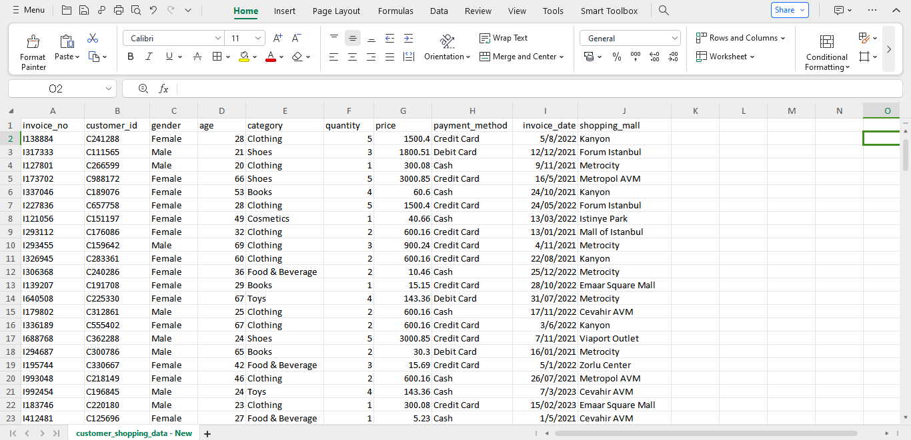
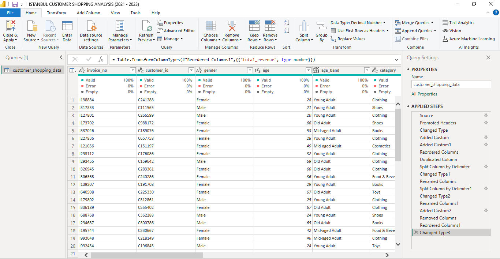
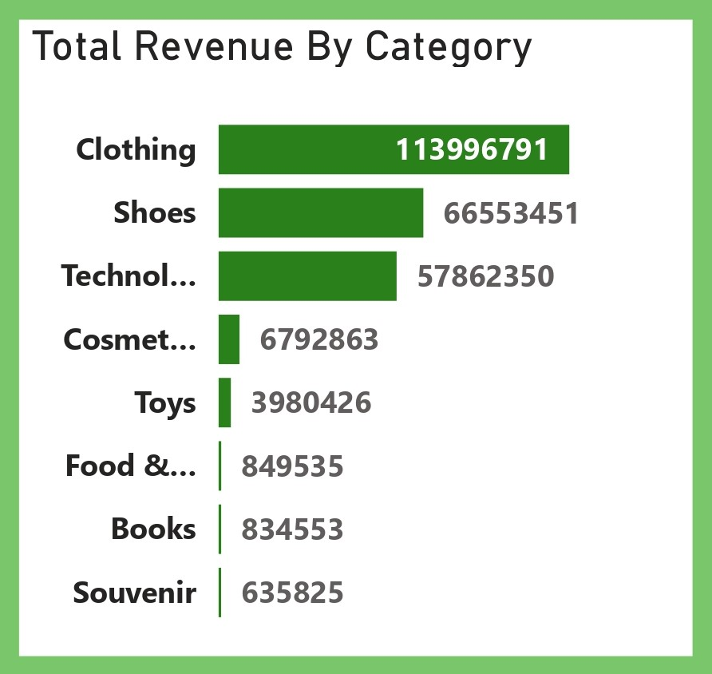
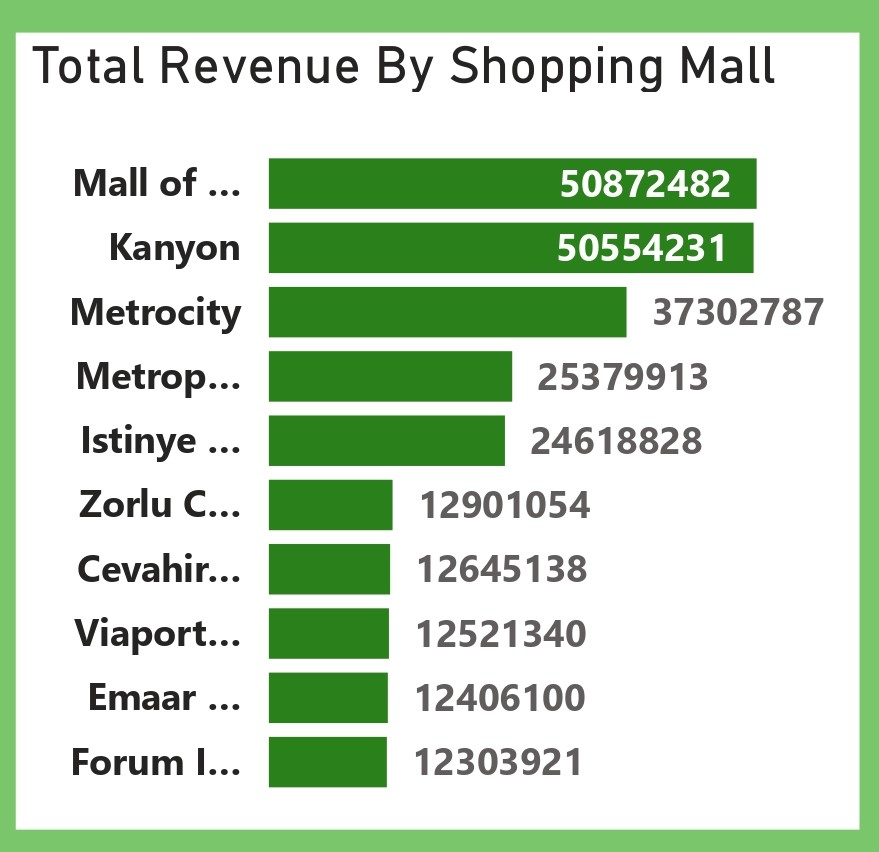
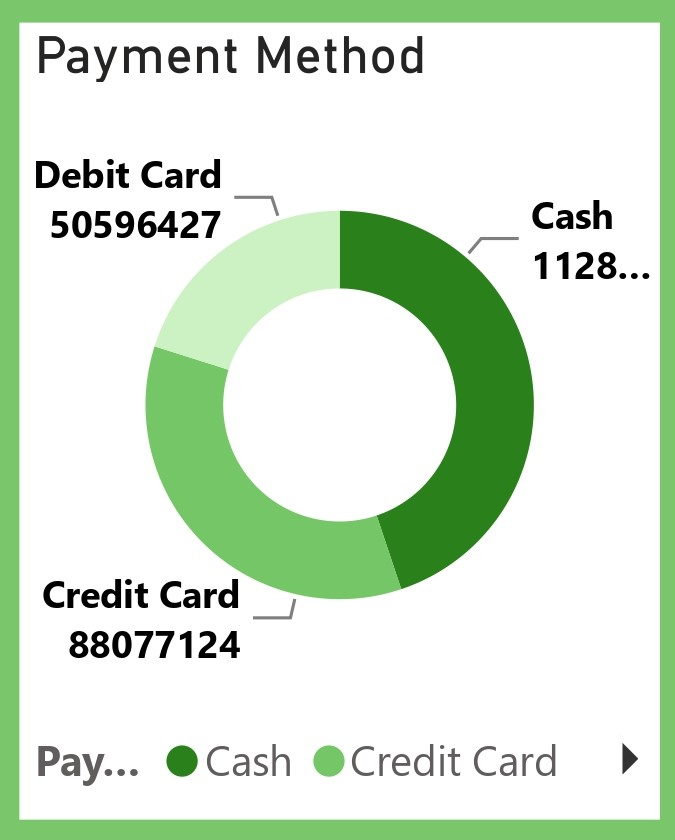

# Istanbul-Customer-Shopping-(2021-2023)-Analysis

## Project Overview
### Introduction:
Welcome to the bustling shopping scene of Istanbul! This project delves into the rich shopping landscape of Istanbul, focusing on data collected from 10 prominent shopping malls spanning the years 2021 to 2023. Our comprehensive dataset encompasses a diverse range of shoppers, capturing insights from various age groups and genders to provide a holistic view of shopping habits in this vibrant city.

### Dataset Overview:
- The dataset comprises vital information crucial for understanding Istanbul's shopping dynamics. It includes details such as invoice numbers, customer IDs, age, gender, payment methods, product categories, quantity, price, order dates, and shopping mall locations.
- By analyzing this rich dataset, we aim to uncover hidden patterns, trends, and correlations that offer valuable insights into consumer behavior and shopping preferences across different demographics.

- This dataset is a CSV file made up of a single table named customer_shopping_data.csv and was provided by [Quantum Analytics](https://www.quantumanalyticsco.org/). You can click on this [link](customer_shopping_data.csv) to access the raw data file. This dataset table is made up of 10 columns and 99,547 rows of data.  

Here's an overview of the table columns along with explanations of the column names:
- __invoice_no:__ This column represents the unique identifier assigned to each invoice or transaction made by a customer. It serves as a reference number to track and identify individual purchases within the dataset.
- __customer_id:__ This column contains the unique identifier assigned to each customer. It allows for the tracking and analysis of shopping behavior and preferences of individual customers across multiple transactions.
- __gender:__ This column indicates the gender of the customer involved in the transaction. It provides insights into the demographic composition of shoppers and allows for gender-based analysis of shopping habits and preferences.
- __age:__ This column represents the age of the customer involved in the transaction. It enables age-based segmentation and analysis of shopping behavior, allowing for insights into how different age groups interact with products and brands.
- __category:__ This column specifies the category or type of product purchased in the transaction. It categorizes products into distinct groups based on their characteristics or functions, facilitating analysis of sales trends and preferences across different product categories.
- __quantity:__ This column indicates the quantity of the product purchased in the transaction. It represents the number of units or items bought by the customer, providing insights into purchasing patterns and consumption habits.
- __price:__ This column denotes the price of the product per unit or item. It represents the cost of the product purchased by the customer, allowing for analysis of transaction values, pricing strategies, and revenue generation.
- __payment_method:__ This column specifies the method of payment used for the transaction. It includes different payment options such as cash, credit card, debit card, mobile payment, etc., providing insights into payment preferences and transactional behaviors.
- __invoice_date:__ This column indicates the date and time when the transaction took place. It records the timestamp of each purchase, enabling analysis of sales trends over time, seasonality, and temporal patterns in shopping behavior.
- __shopping_mall:__ This column identifies the shopping mall or retail location where the transaction occurred. It allows for analysis of shopping preferences and behaviors across different mall locations, as well as assessment of the performance of individual malls in terms of foot traffic and sales.

## Objectives:
- Gain insights into the total revenue by product categories.
- Analyze variations in shopping behavior based on shopping mall locations.
- Gain insights into the total number of customers across shopping malls.
- Analyze variations in shopping behavior based on payment methods.
- Analyze variations in shopping behavior based on shopping by gender.
- Explore correlations between demographic factors such as age band, gender, and shopping habits.
- Gain insights into shopping trends and patterns across different age groups, genders, and total revenue generated.
- Analyze variations in shopping behavior based on Total Revenue by age band and product category.

## Expected Outcomes:
Through meticulous analysis and interpretation of the dataset, the project anticipates generating valuable insights into Istanbul's dynamic shopping ecosystem. These insights can inform various stakeholders, including retailers, marketers, and urban planners, enabling them to make data-driven decisions to enhance customer experiences, optimize inventory management, and drive business growth.

### Tools Used
1. Power Query Editor
    - Was used to:
        1. Extract,
        2. Transform, and
        3. Load all the datasets for this analysis.
           
2. Power BI (Was used to create reports and dashboard for this analysis)
    - The following Power BI Features were incorporated:
        1. DAX
        2. Quick Measures
        3. Filters
        4. Tooltips

### Data Cleaning, Transformation and Loading using the Power Query Editor:
1. I transformed all column data types to the right data types
2. I added a new column __"total_revenue"__ which was derived from multiplying the cata in the __"price"__ column by the data in the __"quantity"__ column.
3. I added a new column __"age_band"__ by extracting the data in the the __"age"__ column and grouping them (Children, Teenager, Young Adult, Mid-aged Adult, and Old Adult) using the "If function".
4. Duplicated the __"invoice_date"__ column into 2 columns, renamed the 2 columns to __invoice_date1__ and __invoice_daste2__.
5. Splitted the __"invoice_date1"__ using the delimiter into day/month/year, changed the name of the splitted column for year to __"invoice_year"__, and changed type to int64.
6. Splitted the __"invoice_date2"__ using the delimiter into day/month/year, changed the name of the splitted column for minth to __"month"__, and changed the type to int64.
7. Created a new column __"invoice_month"__ and filled it up by extracting the data from the __"month"__ , used the "if function" to convert them into months of the year (Jan- Dec) and chnaged the data type to text.
8. removed all the initial duplicated/Splitted columns leaving only the newly created __"invoice_year"__ and __"invoice_month"__ columns to join the other columns already existing.
9. Reordered all coulmns
10. Changed the __"total_revenue"__ data type to Decimal Number.

**Raw Data**
- Below a screenshot of a part of the raw data in .csv file format. You can download the dataset [here](customer_shopping_data.csv).

**Final Power Query Editor screenshot**
- Below is a screenshot of a part of the cleaned data in power query editor. You can access the full Power BI project document [here](https://github.com/Ugochukwuodinaka/Istanbul-Customer-Shopping-Analysis/blob/main/ISTANBUL%20CUSTOMER%20SHOPPING%20ANALYSIS%20(2021%20-%202023).pbix).

## Data Modelling
No data modelling was required since we need just a table for the analysis.

## Visualization in Power BI:
#### Report 1
_Analysis_Dashboard.jpg)

### Project Analysis:
From the analysis, i made the Key Performance findings below:
- The Total Revenue from all the Shopping Malls is __₺251,505,794M__.
- The Number of Shopping Malls for this analysis is __10__.
- The Number of Product Categories is __8__.
- Total Number of Customers is __99,457__.
- Number of Male Customers is __39.975__.
- Number of Female Customers is __59,482__.
- The Average Revenue By Customer is __₺2,529__.
- The Average Age of Customers is __43__.

- 
- **The Total Revenue By Product Category:**
- In this analysis, The provided total revenue by product category indicates a clear hierarchy in terms of revenue generation within the shopping dataset. Here's a breakdown of the top revenue-generating categories:
- __Clothing Tops: $113,996,791__
  - Clothing tops emerge as the top revenue-generating category, signifying a strong demand for Turkish fashionable attire among consumers within Turkey and international customers. In 
    Turkish shopping culture, clothing holds significant importance, reflecting personal style and cultural norms.
    preferences, and social influences.
- __Shoes: $66,553,451__
  - Shoes represent another lucrative category, Turkey is known for durable and classy footwears, suggesting that local and international consumers prioritize footwear as an essential 
    aspect of their wardrobe. Turkish shopping culture often emphasizes the importance of footwear in completing an outfit, whether for everyday wear or special occasions. 
- __Technology: $57,862,550__
  - The technology category encompasses a wide range of electronic devices and gadgets, indicating a growing interest in digital products among consumers locally and internationally. In 
    Turkish shopping culture, there is a noticeable trend towards embracing technology for both practical and recreational purposes.
- __Cosmetics: $6,792,863__
  - Cosmetics cater to personal grooming and self-care needs, reflecting a desire among consumers to enhance their appearance and well-being. Turkish shopping culture places value on 
    personal grooming and maintaining a polished appearance, contributing to the demand for Turkish cosmetics products locally and internationally. 
- __Toys: $3,980,426__
  - Toys appeal to both children and adults, serving as sources of entertainment, creativity, and nostalgia. In Turkish shopping culture, family-oriented values and celebrations play a 
    significant role, driving demand for toys for children and gifts for special occasions. 
- __Food & Beverage: $849,535__
  - Food and beverage products fulfill essential needs for nourishment and enjoyment, reflecting consumer preferences for culinary experiences and dietary choices. Turkish shopping 
    culture encompasses rich culinary traditions and a love for food, influencing the demand for diverse food and beverage products. 
- __Books: $834,553__
  - Books cater to intellectual pursuits, education, and leisure reading, reflecting a desire among consumers for knowledge and entertainment. In Turkish shopping culture, there is a 
    longstanding tradition of literary appreciation and intellectual discourse, driving demand for books across various genres and subjects. 
- __Souvenir: $635,825__
  - Souvenirs serve as tangible mementos of travel experiences and cultural heritage, appealing to tourists and locals alike. In Turkish shopping culture, there is a thriving tourism 
    industry and a rich historical heritage, contributing to the demand for unique souvenirs that capture the essence of Turkish culture. 
- Overall, the variation in product categories contributing to the total revenue reflects the diverse preferences, interests, and cultural influences shaping the Turkish shopping landscape. 

- 
- **The Total Revenue By Shopping Mall Location:**
- In this my analysis, the total revenue breakdown by shopping mall provides valuable insights into consumer spending patterns and shopping behaviors across different retail destinations in Istanbul. Each mall represents a unique shopping environment, catering to diverse demographics and preferences within the local market.
- __Mall of Istanbul: ₺50,872,482__
  _ Mall of Istanbul emerges as the top revenue-generating mall, indicating its popularity among consumers and its position as a premier shopping destination in Istanbul. This may be 
    attributed to factors such as its extensive range of retail offerings, strategic location, and robust marketing efforts.
- __Kanyon: ₺50,554,231__
  - Kanyon follows closely behind Mall of Istanbul, showcasing its strong appeal and competitive position in the Istanbul retail landscape. Known for its innovative architectural design 
    and upscale shopping experience, Kanyon attracts affluent shoppers seeking luxury brands and upscale amenities.
- __Metrocity: ₺37,302,787__
  - Metrocity ranks third in total revenue, reflecting its prominence as a popular shopping destination in Istanbul. Situated in the bustling business district of Levent, Metrocity 
    caters to a diverse clientele, including professionals, residents, and tourists, with its mix of retail, dining, and entertainment options.
- __Metropol AVM: ₺25,379,913__
  - Metropol AVM maintains a solid position in the market, attracting shoppers with its convenient location and diverse retail offerings. As a neighborhood shopping center, Metropol AVM 
    serves as a community hub, catering to the needs of local residents and providing a convenient shopping experience.
- __Istinye Park: ₺24,618,828__
  - Istinye Park boasts a strong presence in the retail landscape, renowned for its upscale ambiance, luxury boutiques, and extensive leisure amenities. Situated in a prestigious 
    neighborhood, Istinye Park attracts affluent shoppers seeking high-end fashion, gourmet dining, and cultural experiences.
- __Zorlu Centre: ₺12,901,054__
  - Zorlu Centre occupies a niche market position, appealing to discerning shoppers with its blend of luxury brands, designer boutiques, and cutting-edge entertainment offerings. As a 
    lifestyle destination, Zorlu Centre attracts fashion-forward consumers and trendsetters seeking unique experiences.
- __Cevahir AVM: ₺12,645,138__
  - Cevahir AVM rounds out the list, maintaining its status as one of Istanbul's largest and most popular shopping malls. Known for its diverse retail mix, entertainment options, and 
    family-friendly amenities, Cevahir AVM caters to a broad demographic, including families, tourists, and budget-conscious shoppers.

- 
- **Total Revenue By Payment Methods & an Analysis of Variations in Istanbul Shopping Behavior Based on Payment Methods:**
- Here, the breakdown of total revenue by payment method provides valuable insights into the prevalent payment preferences and behaviors of consumers in Istanbul. A deep understanding of these variations can help retailers and businesses tailor their strategies to accommodate different payment methods and enhance the overall shopping experience for customers.
- __Payment by Cash: ₺112,832,243__
  - Payment by cash emerges as the dominant payment method, indicating a significant proportion of consumers in Istanbul prefer to conduct transactions using physical currency. This 
    preference for cash payments may be influenced by several factors:
    - __Cultural Norms:__ Cash payments align with traditional Turkish customs and cultural norms, where using physical currency is often favored for transactions.
    - __Privacy and Anonymity:__ Cash transactions provide a level of anonymity and privacy for consumers, particularly those who value discretion in their financial transactions.
    - __Financial Control:__ Some consumers may prefer cash payments as a way to manage their spending and avoid accumulating debt, as transactions are limited to available funds.
- __Credit Card: ₺88,077,124__
  - Credit card transactions rank second in total revenue, highlighting the popularity and widespread adoption of electronic payment methods among Istanbul consumers. The preference for 
    credit card payments may be driven by the following factors:
    - __Convenience:__ Credit cards offer a convenient and secure payment option, allowing consumers to make purchases without carrying physical cash.
    - __Rewards and Benefits:__ Many credit cards offer rewards, cashback, or loyalty points, incentivizing consumers to use credit cards for their purchases and benefit from these 
      perks.
    - __Financial Flexibility:__ Credit cards provide consumers with the flexibility to pay for purchases over time through installment plans or revolving credit lines, enabling them to 
      manage their finances more effectively.
- __Debit Card: ₺50,596,427__
  - Debit card transactions represent another significant portion of total revenue, indicating the popularity of using bank-issued debit cards for payments among Istanbul consumers. The 
    preference for debit card payments may be influenced by the following factors:
    - __Immediate Funds Access:__ Debit cards allow consumers to access funds directly from their bank accounts, providing a convenient and efficient payment option for everyday 
      transactions.
    - __Security and Fraud Protection:__ Debit cards offer security features such as PIN authentication and fraud monitoring, providing consumers with peace of mind when making 
      purchases.
    - __Budget Management:__ Debit cards help consumers manage their finances by limiting spending to available funds, promoting responsible spending habits and avoiding debt 
      accumulation.

- __Variations in Istanbul Shopping Behavior Based on Payment Methods:__
  - __Cash Payments:__ Consumers favoring cash payments may prioritize privacy, financial control, and adherence to cultural norms. 
  - __Credit Card Payments:__ Consumers using credit cards may seek convenience, rewards, and financial flexibility. 
  - __Debit Card Payments:__ Consumers opting for debit card payments value immediate funds access, security, and budget management.

